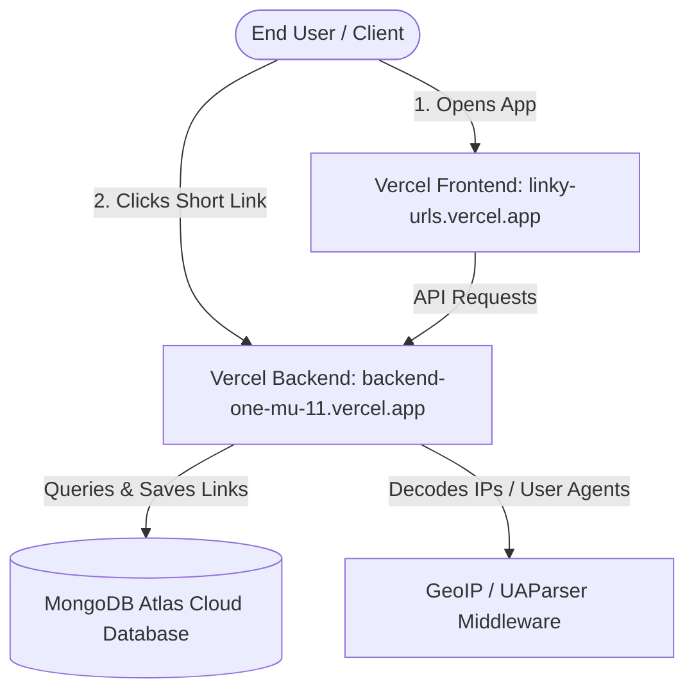

# Linky – Smart URL Shortener

Linky is a high-performance URL shortening application built for the **Katomaran Hackathon 2026**. It allows users to convert long, complex URLs into custom, trackable short links, while providing real-time analytics with device, browser, and geo-demographics breakdown.

---

## 🚀 Live Demo

* **Frontend Web App:** [https://linky-urls.vercel.app](https://linky-urls.vercel.app)
* **Backend API Server:** [https://backend-one-mu-11.vercel.app](https://backend-one-mu-11.vercel.app)

---

## 📺 Video Demonstration
> [!IMPORTANT]
> A Loom or YouTube video explaining and demonstrating the application can be added below.
* **Explanatory Video Link:** [Insert Video URL Here]

---

## 📋 Table of Contents
1. [AI Planning Document](#-ai-planning-document)
2. [Features Documentation](#-features-documentation)
3. [System Architecture](#-system-architecture)
4. [Assumptions Made](#-assumptions-made)
5. [Setup Instructions](#-setup-instructions)

---

## 🧠 AI Planning Document

### 1. Planning the App
The app was designed with a dual focus: high performance (under 50ms response times for redirects) and a modern, beautiful developer-centric dashboard.
* **Phased Strategy:**
  1. *Core Setup:* Node.js backend with MongoDB Mongoose schemas; Vite-based frontend shell.
  2. *Redirection Layer:* NanoID-based redirection routing to ensure minimal database latency.
  3. *Security Layer:* JWT authentication and rate limiting to prevent DDoS or spam redirection creations.
  4. *Analytics Layer:* Advanced request metadata parsing (User-Agent, GeoIP) to compile rich metrics.
  5. *Monorepo Deployment:* Multi-project Vercel integration and cloud database connection.

---

## 📝 Features Documentation

### 1. URL Shortening & Custom Aliases
* **Description:** Convert any valid HTTP/HTTPS URL into a short URL slug.
* **Custom Aliases:** Users can customize the short code (e.g., `https://linky-urls.vercel.app/my-promo`) instead of random codes.
* **Validation:** Both frontend and backend validate URL structure to prevent malicious scripts or broken targets.

### 2. Live Advanced Analytics
* **TIMELINE:** Clicks parsed over time.
* **DEVICES & BROWSERS:** Decodes User-Agents into mobile/tablet/desktop and corresponding browser engines (Chrome, Firefox, Safari, etc.).
* **GEOGRAPHY:** Detects IP-based geolocation coordinates to attribute clicks to specific countries.
* **REFERRERS:** Highlights where visitors originated (e.g. Google, Twitter, LinkedIn).

### 3. Bulk CSV Upload
* **Description:** Allows batch-processing of URLs. Users can upload a `.csv` file with up to 50 long URLs and download a generated CSV containing all short links in a single click.

### 4. Link Expiration & Privacy Controls
* **Expiration:** Set an optional expiration timestamp. Once reached, the URL will return a `410 Gone` error.
* **Privacy Toggle:** Users can make the analytics dashboard public (viewable by anyone with the link) or private (only viewable by the creator).

---

## 🏗 System Architecture

The following diagram illustrates how requests flow from clients through Vercel and MongoDB Atlas:



---

## 💡 Assumptions Made

1. **Vercel Serverless Behavior:** Cold starts are mitigated through light package footprints. Environment variables (`BASE_URL`, `FRONTEND_URL`) are configured to properly handle production rewrites.
2. **MongoDB Atlas IP Access:** Cloud database network access list is set to allow connections from anywhere (`0.0.0.0/0`) because Vercel uses dynamic outbound IP addresses.
3. **CORS Configuration:** Origin verification handles arrays of allowed domains to prevent Cross-Origin Request Blockages.
4. **Geolocation:** The system utilizes server headers and geo packages to approximate country locations.

---

## 🛠 Setup Instructions

### Prerequisites
* Node.js v18+
* MongoDB running locally (for development) or MongoDB Atlas (for production)

### Local Development Setup

1. **Clone and Navigate:**
   ```bash
   git clone https://github.com/N4veen4/Linky.git
   cd Linky
   ```

2. **Backend Setup:**
   * Go to `backend` folder, run `npm install`.
   * Create a `.env` file inside `backend/`:
     ```env
     PORT=5000
     MONGODB_URI=mongodb://127.0.0.1:27017/url_shortener
     JWT_SECRET=mysecretkey
     JWT_EXPIRES_IN=7d
     BASE_URL=http://localhost:5000
     NODE_ENV=development
     FRONTEND_URL=http://localhost:5173
     ```
   * Start server: `npm run dev`.

3. **Frontend Setup:**
   * Go to `frontend` folder, run `npm install`.
   * Create a `.env` file inside `frontend/`:
     ```env
     VITE_API_URL=http://localhost:5000/api
     ```
   * Start Vite client: `npm run dev`.
   * Open `http://localhost:5173`.

---

This project is a part of a hackathon run by https://katomaran.com
